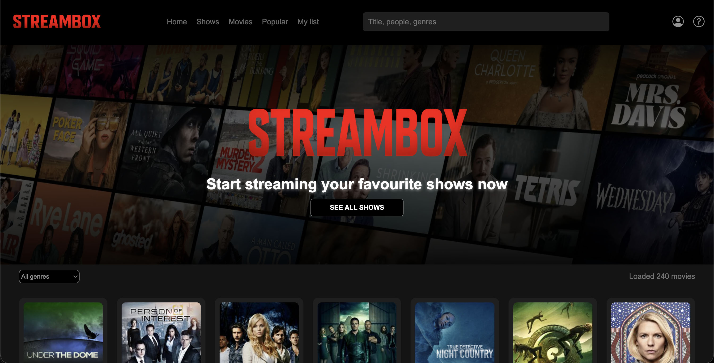
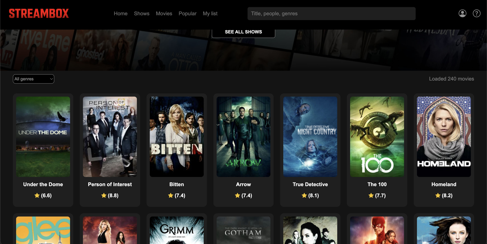
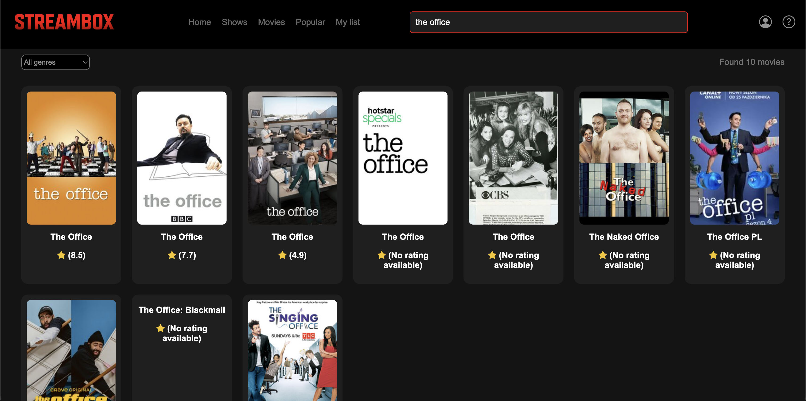
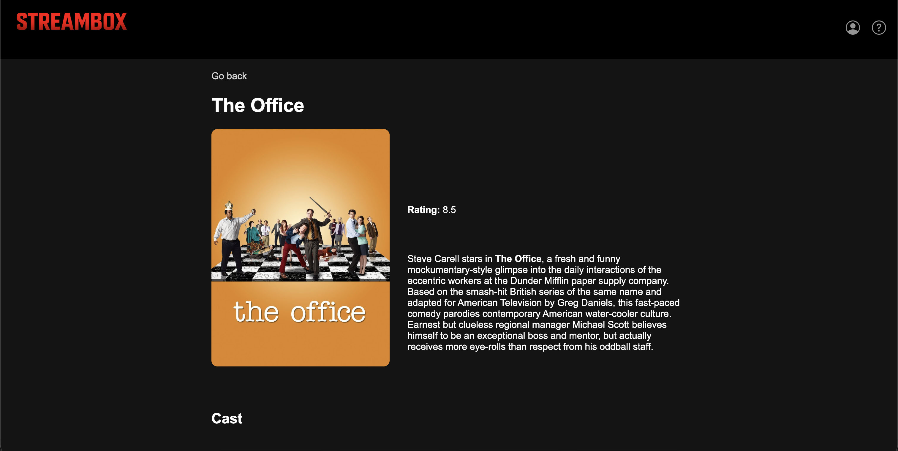
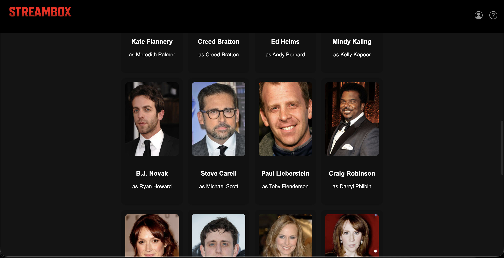

# Steambox

- A streaming platform mockup built with HTML, CSS, and JavaScript, using the TVMaze API.

## Screenshots

## How It Works

- Fetches TV shows from the TVMaze API
- Displays shows in a responsive grid layout
- Allows users to search for shows by title
- Allows users to filter shows by genre
- Clicking a show opens a details page with full information

## Features

- Live search (results appear after typing 2+ characters)
- Genre filter dropdown
- Hero section with CTA
- Show details page
- Cast list for each show
- Responsive layout (desktop, tablet, mobile)
- Hover effects on cards
